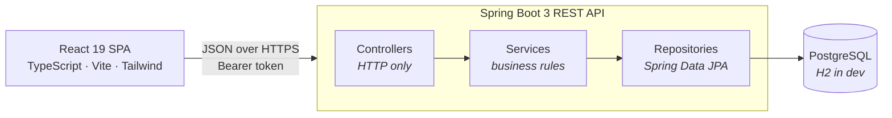

# Cycle Haven

A full-stack e-commerce store for a bicycle shop — **Spring Boot 3 REST API + React 19 SPA**.

This is a ground-up rewrite of a 2024 university project that was built with Java servlets and
JSPs. The original still exists, unchanged, at
[**MO2293/cycle-website-original**](https://github.com/MO2293/cycle-website-original) — it's worth
a look, because most of what follows is about the specific things that were wrong with it and how
they were fixed.

> **Demonstration project.** No real orders are placed and no payments are processed. Checkout
> validates card input and simulates an authorisation; no payment provider is integrated and no
> money moves. Catalogue data and product imagery are carried over from the original 2024
> coursework; the shop itself is fictional.

---

## Contents

- [What it does](#what-it-does)
- [Running it](#running-it)
- [Architecture](#architecture)
- [What changed, and why](#what-changed-and-why)
- [Testing](#testing)
- [API documentation](#api-documentation)
- [Project layout](#project-layout)

---

## What it does

**Storefront** — browse 17 bikes across six categories, with filtering by category, colour and
price, full-text search, sorting and pagination. Guests can build a cart without an account; it
merges into their profile when they sign in.

**Checkout** — cart, address and payment details, with card validation and stock checks. Orders
are recorded with the price each item sold for, and stock is decremented atomically.

**Accounts** — registration and login with JWT authentication, editable profile, password change,
and order history.

**Admin** — dashboard with revenue and stock warnings, full product CRUD with image upload, a
sales report filterable by customer, and user/role management.

---

## Running it

### With Docker — one command, nothing to install

```bash
git clone https://github.com/MO2293/Cycle-Website.git
cd Cycle-Website
docker compose up --build
```

Then open **http://localhost:3000**. Sign in as `admin@cyclehaven.com` / `AdminPass123!`.

The catalogue seeds itself on first start, so the shop is fully populated immediately.

### Without Docker

Two terminals. **Backend** (Java 21):

```bash
cd backend
mvn spring-boot:run          # http://localhost:8080
```

It uses a file-based H2 database by default, so there is no database to install or configure.

**Frontend** (Node 22):

```bash
cd frontend
npm install
npm run dev                  # http://localhost:5173
```

> Worth contrasting with the original, which required installing Tomcat, installing MySQL,
> importing a 12 MB SQL dump by hand, and editing a hardcoded password in `ConnectionProvider.java`
> before it would start.

---

## Architecture



The two halves are fully decoupled: the API serves JSON and renders no HTML, so the same backend
could serve a mobile client or a partner integration without modification.

Inside the API, each layer has exactly one job. Controllers translate HTTP and nothing else.
Services hold the rules — stock clamping, checkout, pricing — and know nothing about HTTP, which
is what makes them unit-testable without a web server. Repositories are interfaces; Spring Data
generates the queries.

### Stack

| | |
|---|---|
| **Backend** | Java 21, Spring Boot 3.3, Spring Security, Spring Data JPA, Hibernate |
| **Database** | PostgreSQL in production, H2 for local development and tests |
| **Auth** | Stateless JWT (JJWT), BCrypt password hashing, role-based authorisation |
| **Frontend** | React 19, TypeScript, Vite, Tailwind CSS 4, React Router 7 |
| **Testing** | JUnit 5, Mockito, AssertJ, Spring MockMvc |
| **Docs** | OpenAPI 3 / Swagger UI, generated from the controllers |
| **Ops** | Multi-stage Docker builds, Docker Compose, GitHub Actions CI |

---

## What changed, and why

The rewrite was driven by specific defects in the original. These are the ones worth naming.

### Security

**A hardcoded admin backdoor.** `LoginServlet` opened with a literal credential check that granted
full admin access, and those credentials were also published in the repository's README:

```java
if ("EECS4413@gmail.com".equalsIgnoreCase(email) && "4413".equals(password)) {
    session.setAttribute("email", email);
    response.sendRedirect("adminIndex.jsp");
}
```

Admin is now a role on a real account, seeded from configuration rather than compiled into the
source.

**Passwords stored in plaintext.** Authentication was `select * from account where email = ? AND
password = ?`, which only works if passwords are readable. Anyone with a copy of the database had
every customer's actual password. Now only a BCrypt hash is stored.

**No access control on admin pages.** `adminUsers.jsp` and `addItem.jsp` were files under the
webapp root — reachable by anyone who typed the URL. The only thing "protecting" them was that the
nav bar didn't show the link. Authorisation is now enforced server-side in `SecurityConfig`.

**The client decided the price.** Checkout read the order total from a form field:

```java
double totalAmount = Double.parseDouble(request.getParameter("totalAmount"));
```

Edit the field, buy a $4,000 bike for a dollar. The fix was not to validate that number but to
stop accepting one — `CheckoutRequest` has no price field at all, and the total is summed from
database prices inside the transaction.

**Card numbers and CVVs stored in plaintext.** Only a masked last-4 and card brand are retained
now; the number and CVV are validated, used, and discarded.

**Cart ownership taken from the URL.** `cartServlet?email=someone@example.com&id=5` let anyone
modify anyone's cart by editing the address bar. Ownership now comes from the verified token, and
the API has no parameter for it.

**Uploaded images served with no content type**, allowing a stored-XSS vector via an uploaded HTML
or SVG file. Uploads are now restricted to a content-type allow-list.

### Correctness

**Adding zero of something deleted it from your cart.** The add-to-cart servlet handled add and
remove in one branch:

```java
q1 += c1;
if (c1 == 0)       addProductToCart(...);
else if (q1 == c1) removeCartItem(...);   // fires whenever quantity == 0
```

Add, update and remove are now separate endpoints, and quantity has a minimum of 1.

**Every anonymous visitor shared one cart.** Guest carts were stored under the literal email
`guest@cyclehaven.com`, so two simultaneous visitors saw each other's items and one guest checking
out emptied the cart for everyone. Guests now hold a cart in their own browser, merged into their
account on sign-in.

**A multi-item order was stored as unrelated rows.** Checkout generated a fresh UUID *per cart
line*, so buying three bikes created three disconnected "orders" and the concept of one order with
three items did not exist in the schema. Orders now own their line items.

**The sales report rewrote history.** It read the *current* price when displaying past orders, so
changing a price retroactively changed what previous customers had apparently paid. Each line now
records `priceAtPurchase`.

**Nothing was atomic.** Checkout looped over items inserting orders and updating stock one at a
time, breaking on first failure — leaving some orders placed, some stock decremented, and the cart
untouched. It is now a single transaction.

**Products were created on a GET request**, meaning a crawler or a prefetch could add inventory.

**Filtering ran in nested loops inside the JSP** over every row in the table, and duplicated any
product matching two selected filters. Filtering is now SQL, composed with JPA Specifications.

**Money was stored as `double`.** It is `BigDecimal` now.

### Practice

- 25 × `e.printStackTrace()` followed by returning `null` or `false` → SLF4J logging plus a global
  exception handler returning structured JSON
- Jars committed to `WEB-INF/lib`, including two different MySQL drivers → Maven
- Database credentials hardcoded in source → environment variables, profile-based configuration
- `select * from items` loading every row and every image blob to render one page → pagination,
  lazy-loaded blobs, cache headers
- `category` as free-text, which is why the production data contains values like `'4124'` and
  `'dsads'` → a typed enum, rejected at the API boundary

---

## Testing

```bash
cd backend
mvn test
```

Around 36 tests across two layers.

**Unit tests** mock the repositories, so they run in milliseconds with no database and no Spring
context. Each pins down a specific defect from the list above — that checkout totals come from the
database, that payment is never attempted when stock is insufficient, that a clamped quantity is
reported to the user, that registration cannot self-assign the ADMIN role.

**Integration tests** start the full application against in-memory H2 and make real HTTP calls.
These check wiring rather than logic: a security rule can be written correctly and still never
apply, and no unit test would notice.

---

## API documentation

With the backend running: **http://localhost:8080/swagger-ui.html**

Generated from the controllers themselves, so it cannot drift out of date. Click **Authorize**,
paste a token from `POST /api/auth/login`, and every endpoint is callable from the browser.

| | |
|---|---|
| `POST /api/auth/register` · `POST /api/auth/login` · `GET /api/auth/me` | Authentication |
| `GET /api/items` · `GET /api/items/{id}` · `GET /api/items/{id}/image` | Catalogue (public) |
| `POST/PUT/DELETE /api/items` | Product management (admin) |
| `GET/POST/PUT/DELETE /api/cart` | Cart (authenticated) |
| `POST /api/orders` · `POST /api/orders/guest` · `GET /api/orders/me` | Checkout and history |
| `GET /api/admin/orders` · `GET /api/admin/users` | Admin (ADMIN role) |

---

## Project layout

```
backend/
  src/main/java/com/cyclehaven/
    controller/   REST endpoints — HTTP translation only
    service/      business rules; unit-tested without Spring
    repository/   Spring Data interfaces + JPA Specifications
    entity/       JPA entities
    dto/          request/response records; entities never leave the service layer
    security/     JWT filter, user details, JSON 401/403 handlers
    config/       security policy, OpenAPI, data seeding
  src/test/java/  unit and integration tests

frontend/
  src/
    api/          typed API client; the only place fetch is called
    context/      auth and cart state
    components/   shared UI
    pages/        one file per route, including admin/

legacy/           the original 2024 .war, SQL dump and Dockerfile
```

---

## Notes and known simplifications

Being explicit about what this project does *not* do:

- **Payments are simulated.** No processor is integrated. `PaymentService` is an interface with one
  simulated implementation, so a real gateway would be a second implementation rather than a
  rewrite of checkout.
- **Schema is managed by Hibernate** (`ddl-auto: update`) rather than versioned migrations. Flyway
  would be the correct choice for a system with real data to protect.
- **Tokens are stored in `localStorage`**, which is standard for a SPA but leaves them readable by
  any script on the page. httpOnly cookies with CSRF protection would be stronger.
- **Product images are stored as database blobs.** Fine at this scale; object storage behind a CDN
  is the right answer past it.

---

Built by [Mo Farah](https://github.com/MO2293). Original 2024 version:
[MO2293/cycle-website-original](https://github.com/MO2293/cycle-website-original).
